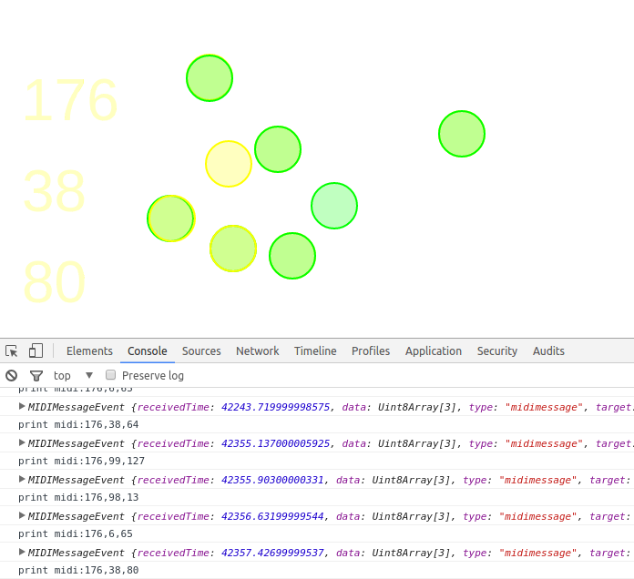

# p5_Stage2
Isolating MIDI channels and preparing for list of countries as data

Includes the p5 MIDI API plugin from https://github.com/therewasaguy/p5.midi.
When receiving midi input, midi data from two channels is printed to the canvas and logged to the console.
Circles are drawn on mouse click and mouse press too.
Updating is dependent on channel. Preparing for external data with 'countries' placeholders.

